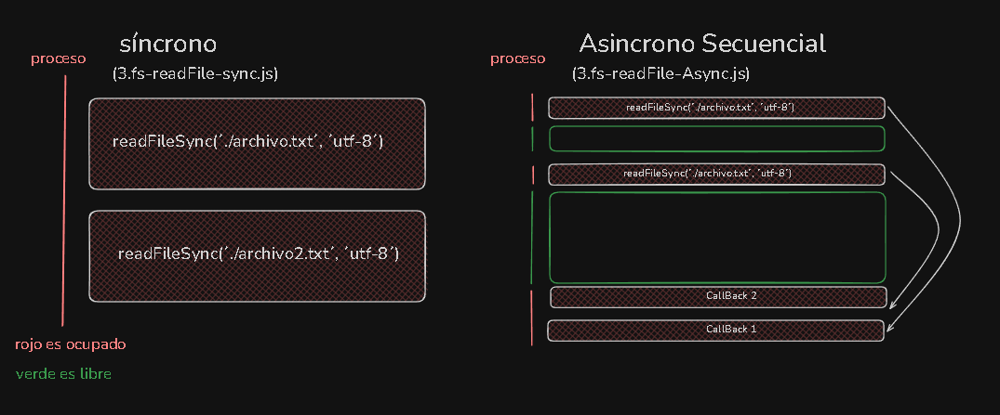

## Async Await

- El async/await es una característica de JavaScript que nos permite trabajar con funciones asíncronas de una manera mucho más sencilla y clara.

- La palabra clave async se utiliza para declarar una función asíncrona, la cual devuelve un objeto AsyncFunction.

```javascript
import { readFile } from 'node:fs/promises';

const text = await readFile('../../Parte_2/txt/holamundo.txt', 'utf-8');

const text2 = await readFile('../../Parte_2/txt/holamundo2.txt', 'utf-8');

console.log(text);
console.log(text2);

```

- En CommonJS, no se puede utilizar la palabra reservada await de forma directa en el nivel superior, por lo que se debe usar la función .then().

En ECMAScript Modules (ESM), sí se puede utilizar await en el nivel superior (top-level await).


### IIFE - Immediately Invoked Function Expression

- Sirve para que el código que se encuentra dentro de la función se ejecute inmediatamente, sin necesidad de llamarla.


```javascript

const {readFile} = require('node:fs/promises'); // El punto y coma es importante sino el codigo no funciona

(
   async () => {
        const text = await readFile('../Parte_2/txt/holamundo.txt', 'utf-8');
        const text2 = await readFile('../Parte_2/txt/holamundo2.txt', 'utf-8');
        console.log(text);
        console.log(text2);
    }
)();

```

## Asyncronia en Paralelo

- Para ejecutar varias tareas asíncronas en paralelo, se pueden utilizar Promise.all() o Promise.allSettled().

- Esto es bueno porque se pueden ejecutar varias tareas asíncronas al mismo tiempo, en lugar de esperar a que una termine para ejecutar la siguiente.

- Pero es malo porque si una de las tareas falla, todas las demás también fallarán.

```javascript - msj

import { readFile } from 'node:fs/promises';

Promise.all([
    readFile('../../Parte_2/txt/holamundo.txt', 'utf-8'),
    readFile('../../Parte_2/txt/holamundo2.txt', 'utf-8')
]).then((texts) => {
    console.log(texts[0]);
    console.log(texts[1]);
});


```

